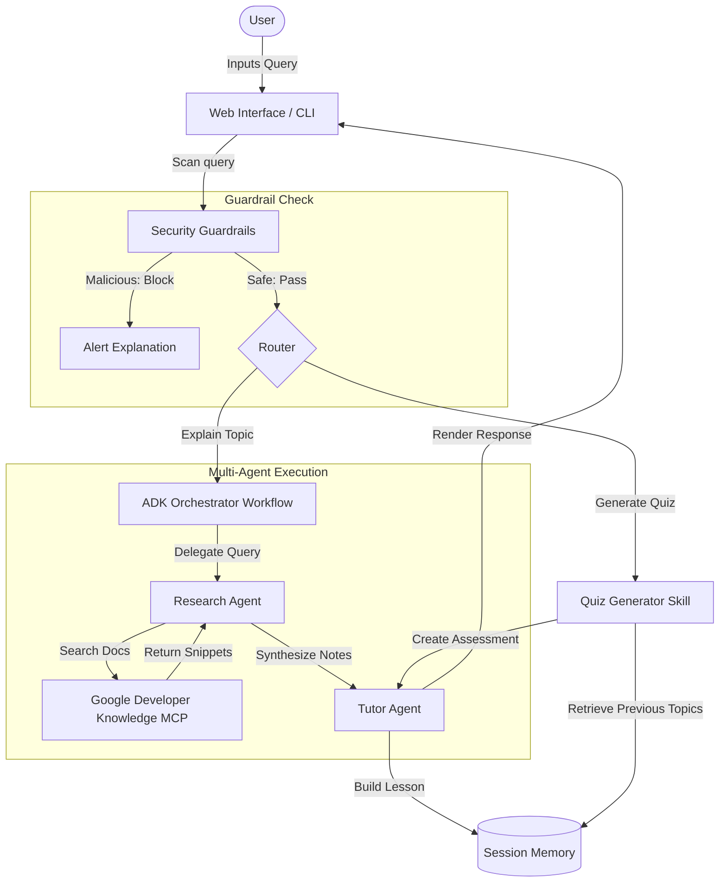

# InfoQuant AI - Multi-Agent Student Learning Assistant

InfoQuant is a portfolio-quality AI agent application designed to explain complex technical concepts to students using a multi-agent workflow powered by the Google Agent Development Kit (ADK) and the Model Context Protocol (MCP).

## Project Overview

InfoQuant turns technical topics (like cloud computing, databases, and algorithms) into beginner-friendly explanations with a simple analogy, key concept breakdowns, and real-world examples. It also features session memory tracking and custom multiple-choice quiz generation to test student learning on-demand.

---

## Problem Statement

Technical documentation is often too dense, jargon-heavy, and dry for beginners or students starting their cloud journey. Additionally, static learning platforms lack the ability to adapt to follow-up questions, handle multi-turn context reference, or generate tailored, contextual testing assessments.

---

## The Solution

InfoQuant coordinates specialized agents to retrieve official documentation using Model Context Protocol (MCP), translate technical data into encouraging analogies, track student history, protect against prompt injection inputs, and generate custom multiple-choice quizzes dynamically.

---

## Key Features

1. **Multi-Agent Orchestration**: Sequential workflow coordinates research and tutor agents.
2. **Dynamic MCP Search**: Research agent retrieves official docs via the Google Developer Knowledge MCP server.
3. **Lightweight Session Memory**: Tracks discussed topics and responses locally, allowing natural context referencing.
4. **Security Guardrails**: Standalone input scanner intercepts prompt injection attempts case-insensitively.
5. **Interactive Web Interface**: A premium dark-themed educational UI with markdown rendering.
6. **Automated Evaluation**: Integrated test suite validating prompt protection, memory, and tool usage.

---

## Solution Architecture

Below is the Mermaid workflow diagram reflecting the entire InfoQuant system structure:



---

## Technologies Used

* **Google ADK 2.0**: Orchestration, workflow routing, and agent definitions.
* **Gemini 2.5 Flash**: Dynamic language understanding, synthesis, and tutoring.
* **FastAPI**: Backend web hosting and endpoint API routing.
* **Marked.js**: Client-side Markdown rendering for rich typography.
* **HTML/CSS/JS**: Sleek, glassmorphic dark-theme frontend layout.

---

## Folder Structure

```
info-quant-ai/
├── static/
│   ├── index.html       # Web structure & marked.js integration
│   ├── style.css        # Premium dark slate styling
│   └── script.js        # REST API calls & rendering controller
├── app.py               # FastAPI backend endpoints & runner server
├── cli.py               # Interactive CLI loop & runner
├── researcher.py        # Research Agent configuration & MCPTool integration
├── tutor.py             # Tutor Agent instructions
├── orchestrator.py      # Workflow layout definitions
├── memory.py            # SessionMemory data store
├── security.py          # Input guardrail scanner
├── evaluate.py          # Offline and live evaluation testing suite
├── requirements.txt     # Python requirements manifest
└── README.md            # Main documentation
```

---

## Installation & Setup

1. **Clone the repository**:
   ```bash
   git clone https://github.com/<your-username>/info-quant-ai.git
   cd info-quant-ai
   ```

2. **Install dependencies**:
   ```bash
   pip install -r requirements.txt
   ```

3. **Configure Environment Variables**:
   Create a `.env` file in the root directory:
   ```env
   GOOGLE_API_KEY=AIzaSy...
   ```

---

## Running the Application

### 1. Running the Interactive CLI
Launch the terminal learning interface:
```bash
python cli.py
```

### 2. Running the Web Application
Start the FastAPI server:
```bash
python app.py
```
Open your browser and navigate to `http://127.0.0.1:8000` to interact with the learning assistant interface.

### 3. Running Automated Evaluations
Run the evaluation test suite:
```bash
python evaluate.py
```

---

## Example Workflow

1. **User asks**: "Google Cloud Storage"
   * *Under the hood*: Passed through `security.py` (Safe). `researcher.py` queries Google Developer Knowledge MCP, retrieves object storage details, and passes them to `tutor_agent` which formats the lesson.
2. **User follows up**: "Compare this with Local HDD"
   * *Under the hood*: Context builder pulls previous turns from `SessionMemory`. `researcher.py` resolves `"this"` to Google Cloud Storage, retrieves details, and provides a comparative chart.
3. **User generates quiz**: Click "Generate Quiz" or type `quiz`.
   * *Under the hood*: Tutor Agent compiles 5 multiple-choice questions with answers based on the topic session.

---

## Future Improvements

* Integrate vector embeddings for long-term memory.
* Expose dynamic progress tracking dashboard.
* Support customizable quiz difficulties.

---

## License

This project is licensed under the MIT License - see the LICENSE file for details.
